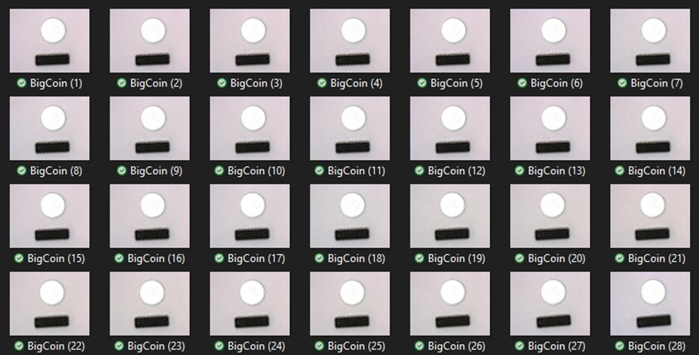
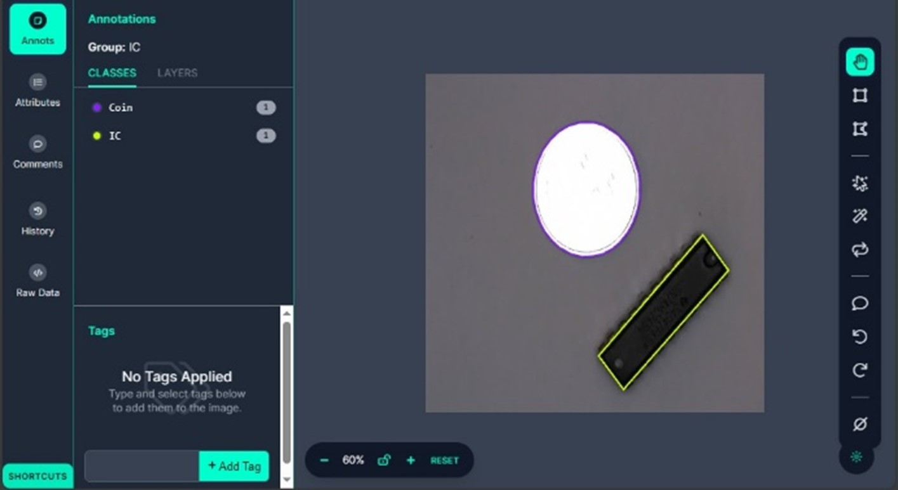

# AI Model for IC measurement
# The AI model is able to detect the IC and reference object (coin) in video and segment out for post processing to determine the width and length of IC in mm.

The program is programmed in Python due to its flexibility and ease of use.
The AI model used is YOLOv8 segmentation model, and the dataset used are annotated in roboflow to segment out the IC and reference coin.
The dataset and model is trained in Google Colab to utilize Google's T4 gpu to train the AI model.

 

   
  Dataset 
   
  Annotation 
   
  Segmentation Result

 
1. Result 1
 

   
  IC is detected regardless of how damaged it is.  

 
2. Result 2
 

   
  IC is detected given that both IC and coin are in perfect condition.  

 
3 Result 3
 

   
  IC cannot be measured due to missing reference object.  

